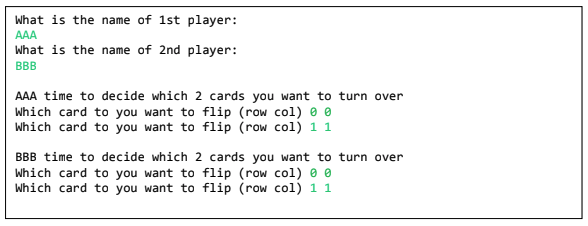
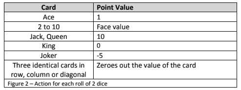
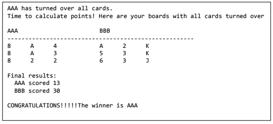
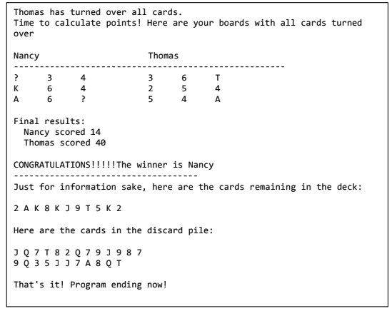

# COMP248_A4-Q2

For this question you will program Nancy’s Card Golf Game. 
To win this game you need some luck with the cards and a bit of strategy. 
Just like the outdoor game of golf the goal is to keep the score as low as possible.
  
Advice on how to tackle this question: 
 - Plan your solution before starting to program. 
   This means be sure you understand how the game works before your program. 
   Write as detailed an algorithm as you can!!! 
 - Start by writing the 1st two classes (DeckAndDiscard & Player) and testing them to make
   sure they work as you expect them to. You don`t want to be debugging your classes and your driver class all at the same time. 
 - When implementing the driver (Golf) do it in chunks. Do not implement the entire game all
at once. It will be harder to debug and will be frustrating.
  
Rules of the game: 
1 - Number of players: 2 
2 - Deck of Cards: Has 54 cards. 4 times (ace, 2 to 10, jack, queen, king) and two jokers. 
3 - Each player is dealt 9 cards which are placed face down in front of them in a 3x3 grid. 
4 - The remainder of the deck is placed in the center of the table and the top card is flipped and
placed face up on the discard pile. The goal from here on is to reduce the value of the cards
each player is holding one card at a time. 
5 - At the start of the game each player decides which two cards from their 9 to flip over.
  

  
6 - The game works as follows: 
Each player has a turn until there is a winner. During his/her turn a player decides if they will
take the card on the discard pile or pick a new card from the deck which is not yet revealed.
- If they opt to pick up the top card from the discard pile they can either swap it for an
already flipped over card or with a non-flipped card. The player must swap with one of
his/her cards in either case. 
a. If an already flipped card - swap the card with the face up card of your choice 
b. If a face down card – flip the card face over and swap. 
In either case, the card being swapped out is placed on the discard pile (as the next player
has the option of picking up this card or a new card from the deck). 
- If they opt to pick up new card from the deck they can 
a. toss it onto the discard pile and not change any of their card, in other words not
use it (usually because it is a high point value card). 
b. decide to swap with an already turned up card 
c. Flip over a face down card and then either swap with card from deck or toss the
card from deck. The card that was turned over remains face up.  

Make sure that when a player is asking to handle an already turned over card, that it is really turned
over. If it is not, tell the user and ask for another card until a turned over card is selected. Similarly,
when a player is selecting a card that is not flipped over make sure that is the case. 
The game is over when a player has their cards all facing up. The other player turns the rest of his/her
cards face up and scores for each player are calculated. The scoring is done according to the chart
below.  

  
The player who turned over all of his/her cards first is not necessarily the winner. The player with the
lowest score is the winner. It is possible that the game ends in a tie.  

  
Here is an example of how the scores are calculated using the case in the screen shot above. 
Player A: 
- Has 3 x 8’s in the 1st column, so these count for zero. 
- So the score is calculated as follows: 
2 x 1 ( since 2 Aces) + 2 x 2 ( since 2 x 2s) + 3 + 4 = 13 
Player B: 
- Kings count for zero points 
- So the score is calculated as follows: 
1 (A) + 5 + 6 + 2 + 2x3 (2x3s) + 0 (2 x Ks) + 10 (J) = 30  

NOTE: We are assuming that it will not take an entire deck to win as this would add a complexity to the solution not included in this version of the game. In the real game, the discard pile is shuffled and reused. 
Also for transparency, at the end of the game, display the remaining cards in the deck and all of the
cards in the discard pile. 
(Note the following screen capture is not from the previous run. So the cards and names don’t match.)  

  
Happy programming and of course, Happy Golfing!
